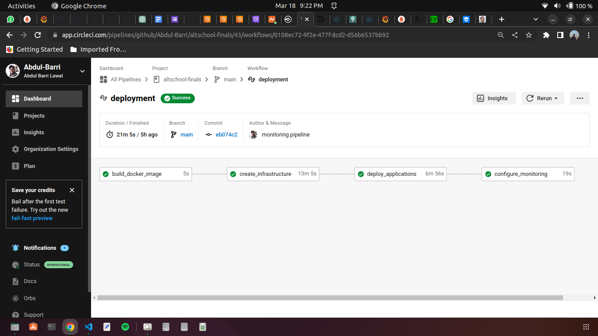
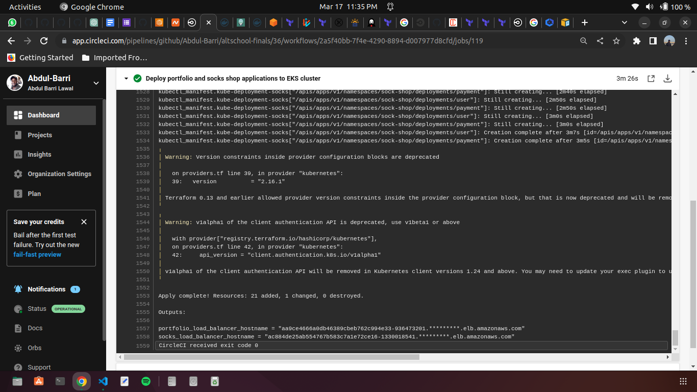
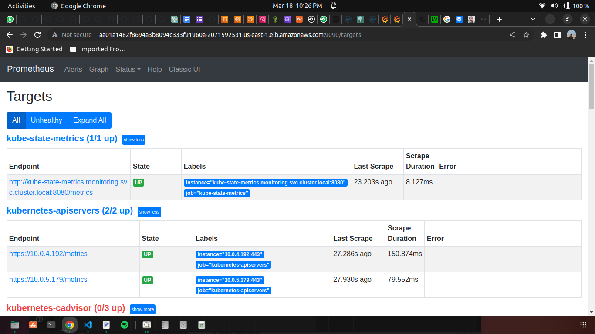
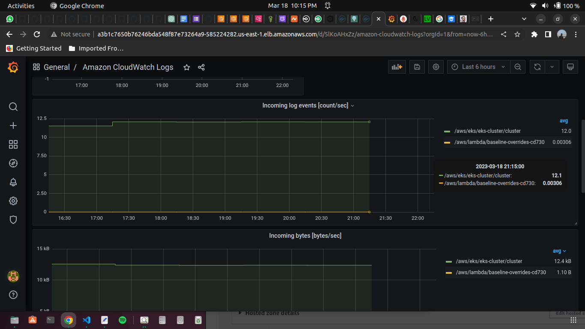
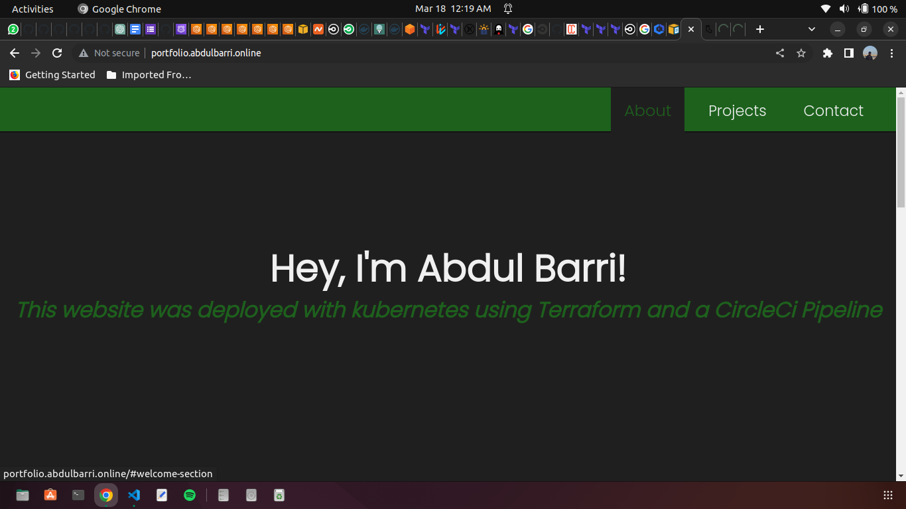
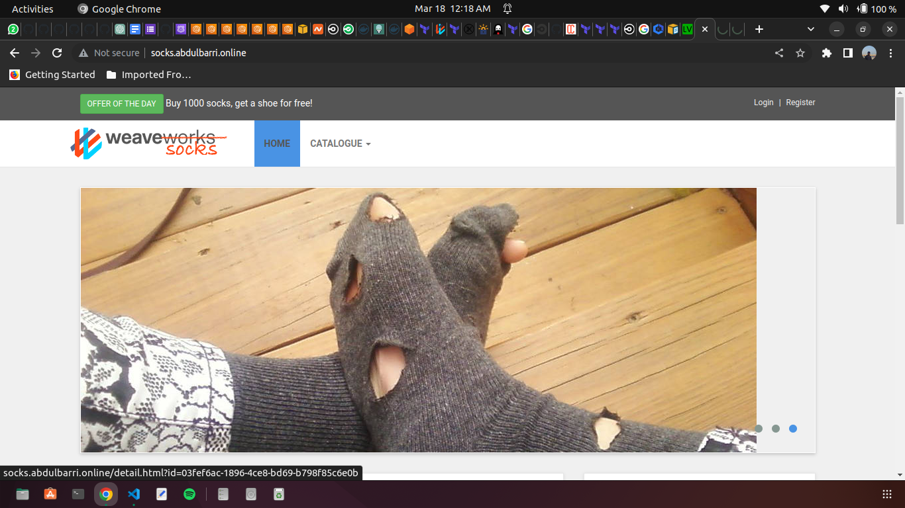

# AltSchool-of-Cloud-Engineering-3rd-Semester-Exam-Submission

This repo contains all files and source codes for AltSchool of Cloud Engineering 3rd Semester Exam Submission

## Tools used and Required

* Terraform
* AWS CLI and Account
* CircleCi
* Prometheus
* Grafana
* Docker and dockerhub
* Kubernetes
* Git and Github
* Domain (namecheap)

## Infrastructure and Deployment Automation

The aim of this project was to deploy two applications, `portfolio` and `socks shop` with kubernetes using an IaC tool. This was achieved using Terraform. The terraform files used for the deployment are contained in the `terraform-files` directory. The terraform files have been separated and arranged in different directories to optimize deployment using a CI/CD pipeline. 

The `backend` folder contains the configuration for the S3 bucket and DynamoDB which will be used as backend and lock for storing the state of the terraform deployment.

The `infrastructure` folder contains the terraform files for deploying the required infrastructure to AWS. It includes the network components like VPC, IGW, NAT-GW, Elastic IPs, Route tables and routes, subnets and security group. It also includes configurations for IAM roles, CloudWatch Log group, EKS node group and EKS cluster.

The `deployment` folder contains the scripts used for deploying the two applications to the AWS infrastructure. Terraform Kubernetes manifest, deployment and service resources were used to deploy the `portfolio` and `socks shop` apps. It also contains configuration for the subdomains, `portfolio.abdulbarri.online` and `socks.abdulbarri.online`.

The `monitoring` folder contains the scripts used to deploy prometheus and grafana to the cluster. This will be used for monnitoring and observing the performance and uptime of the applications.

## CI/CD Pipeline

CI/CD was implemented for this project using `CircleCI`. The code for the CI/CD pipeline can be found in the `.circleci` folder which contains a `config.yml` file containing the code for the CI/CD pipeline. The CI/CD pipeline has six jobs;

1. `build_docker_image`: this job builds the docker image for the portfolio app and pushes the built image to dockerhub image repository.

2. `create_backend_state_store`: this job applies the terraform script(s) in the `terraform-files/backend` directory. This will create and S3 backend and DynamoDB for storing and locking state. This job will only execute if the `backend` branch of the repository is triggered.

3. `create_infrastructure`: this job applies the terraform script(s) in the `terraform-files/infrastructure` directory. This will create the network infrastructure as earlier stated.

4. `deploy_applications`: this job applies the terraform script(s) in the `terraform-files/deployment` directory. This will deploy the two applications to the EKS cluster created in the previous job. It also creates two subdomains and maps the loadbalancers from the two applications to the subdomains.

5. `configure_monitoring`: this job applies the terraform script(s) in the `terraform-files/monitoring` directory. This will deploy prometheus and grafana to the cluster.

6. `destroy_everything`: this job will destroy the whole deployment and infrastructure by executing `terraform destroy --auto-approve` in the `terraform-files/monitoring`, `terraform-files/deployment` and `terraform-files/infrastructure` directories. This job will only execute if the `destroy` branch of the repository is triggered.

The images shows the successful execution of the jobs in the CI/CD pipeline after it was triggered. 

## Monitoring and Observability

Prometheus, Grafana, and CloudWatch were configured for the monitoring and logging of the application and cluster metrics;

* Prometheus access point: [prometheus-url](http://aa01a1482f8694a3b8094c333f91960a-2071592531.us-east-1.elb.amazonaws.com:9090/targets)

* Grafana access point: [grafana-url](http://a3b1c7650b76246bda548f87e73264a9-585224282.us-east-1.elb.amazonaws.com/d/5lKoAHxZz/amazon-cloudwatch-logs?orgId=1&from=now-6h&to=now)

## Application Sub-Domains

* Portfolio Website: [portfolio subdomain](http://portfolio.abdulbarri.online)

* Socks Shop Website: [socks_shop subdomain](http://socks.abdulbarri.online)

